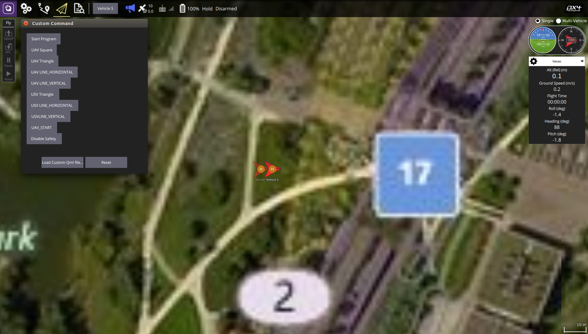

# offboard_multi

基于PX4开源代码，实现多无人机，无人船和水下机器人的多平台协同编队，避碰，队形保持等功能。分为gazebo仿真和实际飞行部分。

代码分为PX4-Firmware 部分和offboard两部分，PX4-Firmware为飞控自驾仪，offboard为无人机上层控制系统，Firmware将无人机位姿信息发送给offboard，由offboard实现编队各项功能。

环境：

1. ubuntu16.04, ROS
2. Firmware: https://github.com/guduzhe123/Firmware branch: 1.8.0-github
3. offboard: branch master
4. mavros: https://github.com/mavlink/mavros/blob/master/mavros/README.md#installation

目前支持的编队方式：1uav-1usv, 2uavs, 4uavs, 4uavs-3usvs,4uavs-3usvs-3uuvs

**1uav-1usv**

一架无人机和一艘无人船的编队。

<video id="video" controls="" preload="none">
    <source id="mp4" src="videos/1uav-1usv.mkv" type="video/mp4">
</video>

```
roslaunch offboard 1UAV_1USV_sim.launch 
```

关于PX4 ROS开发请看：https://dev.px4.cc/master/en/simulation/ros_interface.html， 注意PX4版本，本仿真是在1.8.0基础上开发。

地面站控制指令如下图：控制无人机和无人船的起飞和运行。

教程：https://blog.csdn.net/weixin_38416696/article/details/79435826



**2uavs**

两架无人机编队，实现队形保持，避碰等功能。

```
roslaunch offboard 2UAV_sim.launch 
```

<video id="video" controls="" preload="none">
    <source id="mp4" src="videos/2uavs.mkv" type="video/mp4">
</video>

